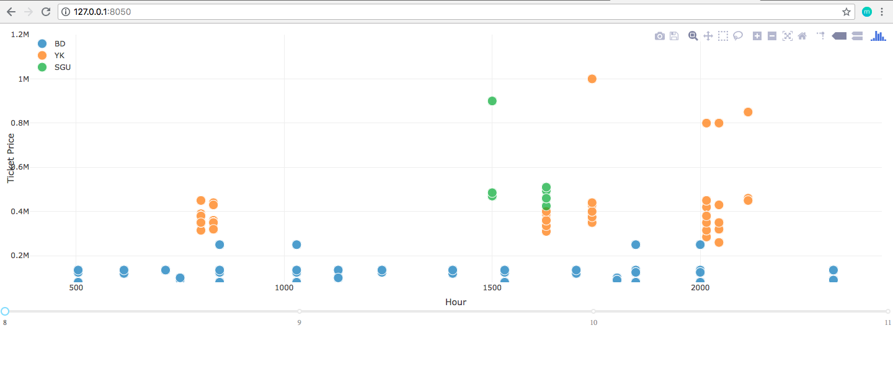
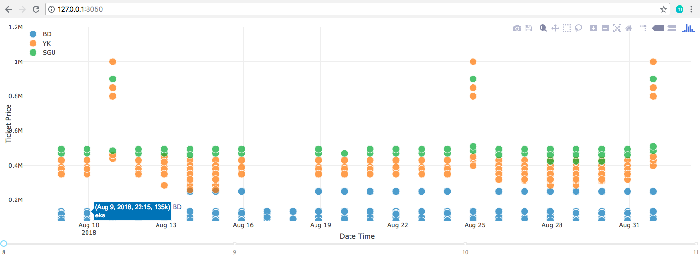
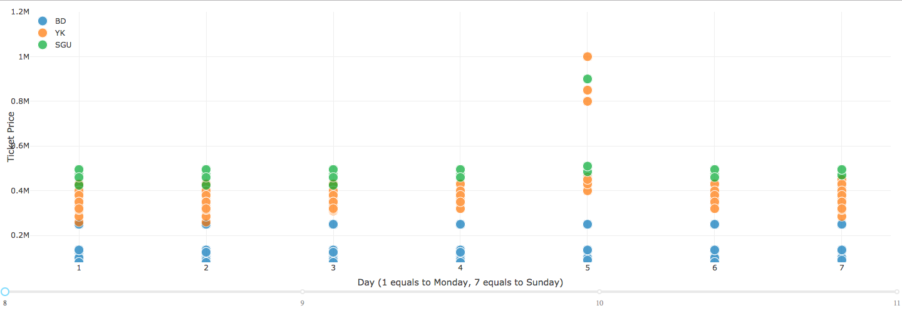
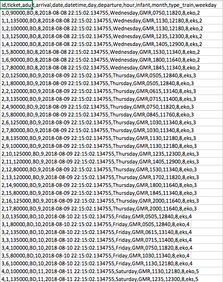

### Artikel

<h2 align="center">
  <br>
  Data Analysis and Visualization : Menganalisa Harga Tiket dan Ketersediaan Tiket Kereta Api
  <br>
  <br>
</h2>

Berlibur merupakan kegiatan yang menyenangkan. Siapa yang tidak suka berlibur? Hal ini yang kerap kali ditunggu oleh setiap orang yang mungkin sudah merasa penat dengan pekerjaan ataupun hal - hal yang sedang dikerjakannya. Berlibur pun bisa dilakukan dengan berbagai cara dan di berbagai tempat. Namun, biasanya warga Jakarta yang telah penat akan suasana Ibu Kota akan cenderung untuk menghabiskan liburannya di luar kota (termasuk saya). Kota tempat berlibur dapat diraih dengan berbagai media. Kereta api merupakan opsi yang cukup digemari karena harganya yang tidak semahal pesawat dan juga kondisi di dalam perjalanan yang sudah terlampau nyaman. Maka dari itu saya mencoba membantu untuk menganalisa harga tiket kereta api dari Stasiun Gambir (Jakarta) menuju kota - kota besar di pulau Jawa seperti Surabaya (Jawa Timur), Yogyakarta (DI Yogyakarta), dan Bandung (Jawa Barat).

Apa yang dianalisis? Harga tiket dan ketersediaan tiket menjadi hal yang sangat penting dalam pemakaian jasa kereta api. Dengan mengetahui dan memahami betul bagaimana kondisi yang ada tentu akan sangat membantu kita dalam menjalani proses transaksi pemakaian. Pemesanan tiket kereta api dapat dilakukan untuk keberangkatan 90 hari setelah hari pemesanan. Dengan crawler yang telah saya buat, saya sudah mengambil data - data terkait tiket kereta api yang terjual di salah satu website. Setelah membersihkan dan memvisualisasikan dengan gambaran yang sesuai, saya mendapatkan beberapa hal yang ternyata menarik.

Dalam 1 minggu terdapat 7 hari. Diantara 7 hari tersebut, Jumat adalah hari di mana harga tiket kereta mencapai titik termahal. Selain itu hari Jumat juga merupakan hari di mana ticket paling cepat habis. Sedangkan, hari Selasa menjadi hari yang paling tidak favorit, di mana ticket yang bersisa paling banyak. Uniknya, saat kita ingin memesan tiket untuk 3 bulan kemudian, tidak tersedia ticket di hari Senin, Selasa, Rabu. Hanya tiket pada hari Kamis, Jumat, Sabtu, dan Minggu yang dapat dipesan.

Saat berbicara tentang jam, data menunjukan bahwa jam 16:30 menjadi waktu yang paling jarang dipilih oleh para pengguna untuk bepergian. Ini dikarenakan 16:30 merupakan waktu di mana orang - orang yang bekerja belum beranjak dari kantor mereka (work hour) dan lebih lagi disebut nangung membuat segala sesuatu menjadi mepet dan tergesa - gesa. Sedangkan waktu - waktu seperti pagi hari dan malam hari banyak diminati karena malam hari bisa dipakai untuk sekalian beristirahat dalam perjalanan. Perjalanan yang dimulai pada saat golden hour menghasilkan tiket termahal.

Jakarta - Bandung menjadi penyedia keberangkatan terbanyak. Hal ini dikarenakan banyak mahasiswa Jakarta yang berkuliah di Bandung, begitu juga sebaliknya, dan tidak hanya mahasiswa namun juga mereka yang bekerja. Yang menarik di sini adalah, meski jarak Jakarta - Jogja dan Jakarta - Surabaya bisa terbilang cukup jauh, namun harga tiket yang dijual tidak berbeda jauh. Bahkan ada tiket yang menuju Jogja lebih mahal dari menuju Surabaya padahal di kelas yang sama. 

Kesimpulan yang dapat ditarik adalah ketika ingin meminimumkan biaya tidak dapat dilakukan dengan cara memesan tiket dari jauh hari, karena mereka cenderung menghasilkan harga yang sama. Waspada ketika beli untuk kepergian di hari weekend di hari Jumat karena jauh lebih cepat habis, dan ada baiknya memesan 1-2 minggu sebelum keberangkatan.

<p align="center">
  <br>
  Basdat Industries - Lab Basdat 2018
  <br>
  <br>
</p>

## How to use
```
To compile the program:
```
To run the program:
```
$ python3 <nama_file>
```

## Screenshots

### Program Screenshot




### CSV Example



## Reference
[Dash Python](http://dash-docs.herokuapp.com/)


## Author

<h3> Timothy Thamrin Andrew H. Sihombing </h3>
<h3> 13516090 </h3>